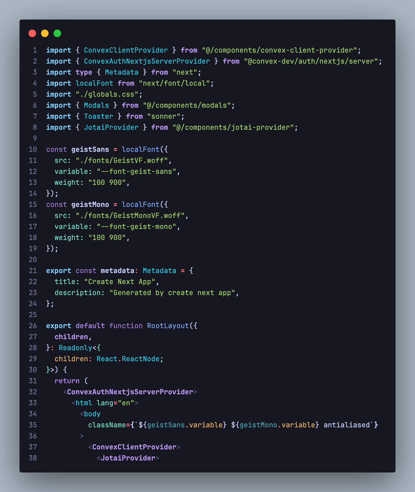

# ionztorm Theme

**A Dark Theme for Visual Studio Code**

Enhance your coding experience with the **ionztorm Theme**, a beautifully designed dark theme for Visual Studio Code that combines aesthetics with functionality. Whether you're working late into the night or just prefer a darker interface, this theme provides a visually pleasing environment that helps reduce eye strain.

### Influence
The theme was originally built for personal use and takes inspiration from Tokyonight vim theme by folke.

### Key Features:
- **Elegant Colour Palette**: A rich selection of colours that make code readable and enjoyable to work with.
- **Syntax Highlighting**: Enhanced syntax highlighting for various programming languages, making it easier to spot errors.
- **Support for Popular Extensions**: Fully compatible with popular VS Code extensions, ensuring a seamless workflow.

### Visuals:
  
*Experience the ionztorm Theme in action!*

### Installation:
To install the ionztorm Theme:
1. Open the Extensions view in Visual Studio Code (`Ctrl+Shift+X`).
2. Search for **ionztorm Theme** and click **Install**.
3. Select the theme from the Color Theme menu (`Ctrl+K Ctrl+T`).

### Feedback & Support:
This is my first theme, so I value your feedback! If you encounter any issues or have suggestions for improvement, please open an issue on our [GitHub repository](https://github.com/ionztorm/ionztorm-theme).

### Contributions:
The theme was built while using React TSX, JSON, Tailwind and HTML, so token colours should work nicely when writing these languages.

If you use different languages and notice missing syntax highlighting, please feel free to submit PR's to implement highlighting.

Also feel free to join the [discord](https://discord.gg/jdH8B8AMzr)
